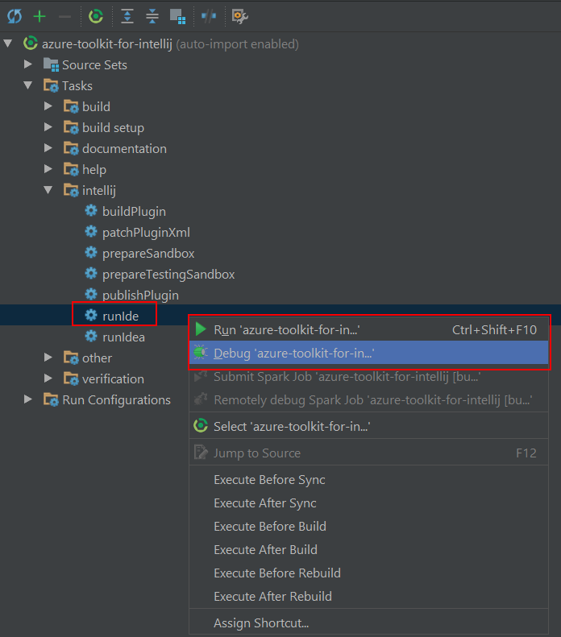
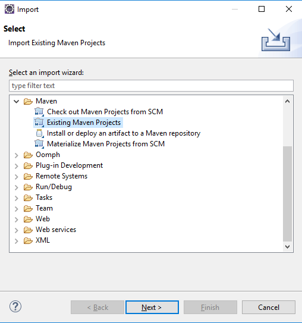
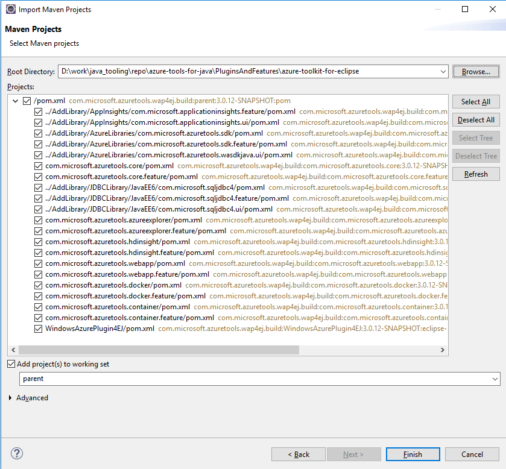
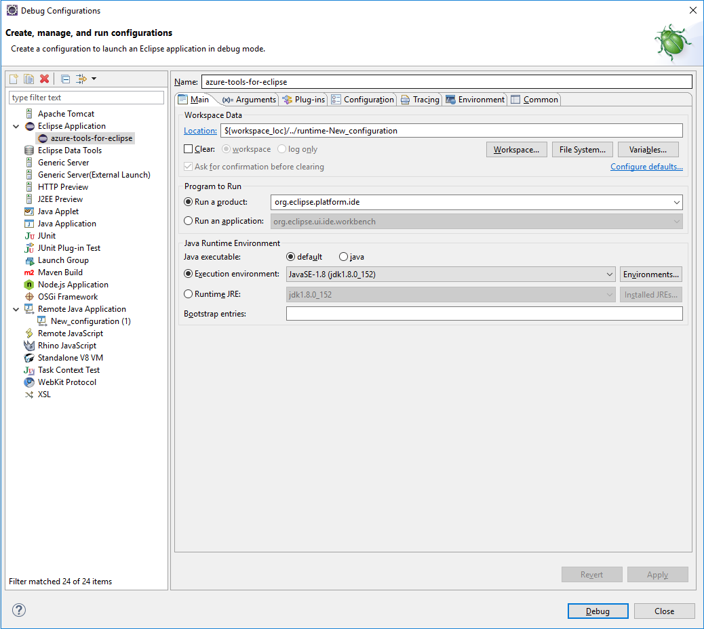

## Azure Toolkit for IntelliJ IDEA
### Building
* Clone the repository with HTTPS or SSH:
    ```
    $ git clone https://github.com/Microsoft/azure-tools-for-java.git
    $ cd azure-tools-for-java
    ```
* Run the following command under the Project base path:
    ```
    $ mvn clean install -f Utils/pom.xml
    ```
* Then you can use gradle to build the plugin
    ```
    $ ./gradlew -b PluginsAndFeatures/azure-toolkit-for-intellij/build.gradle buildPlugin
    ```
    You can find the outputs under ```PluginsAndFeatures/azure-toolkit-for-intellij/build/distributions```
    
### Run/Debug
* Open IntelliJ, import the PluginsAndFeatures/azure-toolkit-for-intellij/build.gradle as *Project*.
* Run/Debug the plugin by trigger the gradle task as following:
    

## Azure Toolkit for Eclipse
### Building
* Clone the repository with HTTPS or SSH:
    ```
    $ git clone https://github.com/Microsoft/azure-tools-for-java.git
    $ cd azure-tools-for-java
    ```
* Run the following command under the Project base path:
    ```
    $ mvn clean install -f Utils/pom.xml
    $ mvn clean install -f PluginsAndFeatures/AddLibrary/AzureLibraries/pom.xml
    ```
* Build the plugin
    ```
    mvn clean install -f PluginsAndFeatures/azure-toolkit-for-eclipse/pom.xml
    ```
    You can find the outputs under ```PluginsAndFeatures/azure-toolkit-for-eclipse/WindowsAzurePlugin4EJ/target```

### Run/Debug
* Open Eclipse, select ```import > Maven > Existing Maven Projects```:
    
* Import all the modules under ```PluginsAndFeatures/azure-toolkit-for-eclipse```:
    
* New a run/debug comfiguration and click Run/Debug:
    
